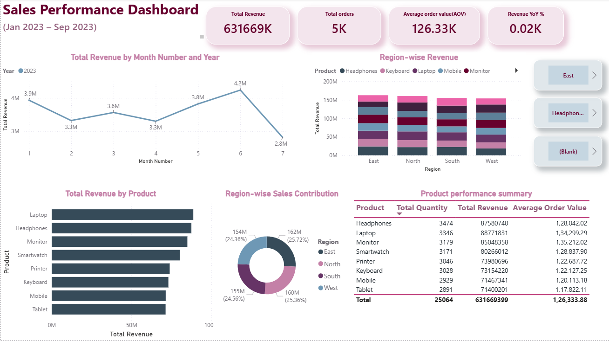
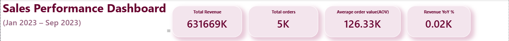
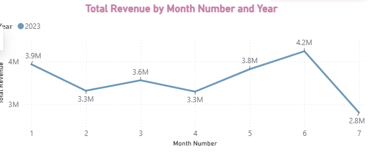
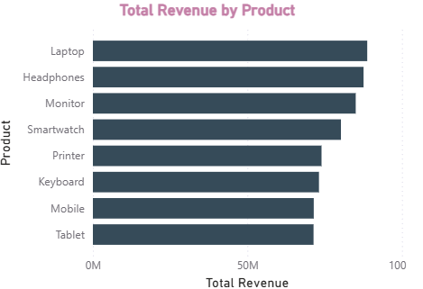

# 📊 Sales Performance Dashboard (Power BI)

A clean and interactive Power BI Sales Performance Dashboard built using a 5,000-row synthetic sales dataset.
This project analyzes revenue, orders, product performance, and region-wise sales using modern data visualization practices.

## 🚀 Project Overview

This dashboard provides insights into:

Total Revenue

Total Orders

Total Quantity Sold

Sales Trends over Time

Top 5 Best-Selling Products

Region-Wise Revenue Distribution

Product Performance Summary

The dataset includes Order Date, Customer, Region, Product, Quantity, Unit Price, and Revenue.

## 📁 Repository Structure

SalesPerformanceDashboard/

│── data/      → Raw and cleaned datasets  
│── pbix/      → Power BI file  
│── images/    → Dashboard screenshots  
│── docs/      → Additional documentation  
│── README.md  → Project documentation

📌 Note: If your .pbix file is larger than 100 MB, you will need Git LFS.

## 🧹 Data Cleaning \& Preparation

Performed in Power Query:

Corrected and validated data types

Created calculated column: Revenue = Quantity × UnitPrice

Added Month, Year, and Month-Year columns

Removed blank and error rows

Standardized formatting for consistency

## 📊 Basic Dashboard Features

🔹 KPI Cards

Total Revenue

Total Orders

Total Quantity Sold

🔹 Monthly Revenue Trend

A line chart showing monthly revenue performance.

🔹 Top 5 Products by Revenue

Highlights the most profitable products.

🔹 Sales by Region

A filled map visualizing region-wise revenue contributions.

🔹 Product Performance Table

Summary of revenue, quantity sold, and average unit price for each product.

## ⭐ Insights

(Replace these with your actual insights after analyzing the dashboard.)

Product laptop generates the highest revenue

Sales peak in Month May, showing seasonal patterns

Region East contributes the most revenue

Certain low-selling products indicate potential optimization opportunities

## 📷 Dashboard Preview

### Advanced Dashboard

### KPI Section

### Revenue Trend

### Top Products

## 🛠 Tools \& Technologies Used

Power BI Desktop

Power Query

DAX

Git \& GitHub

CSV Dataset for analytics

## 📥 How to Use This Project

Clone or download this repository

Open the .pbix file from the /pbix folder

If data does not load automatically:

Go to Home → Transform Data

Load the CSV file from the /data folder

## 🧑‍💻 Author

Preeti R K
Data Analyst | Power BI | SQL | Python
GitHub: https://github.com/preetirk1810

## 📄 License

This project is released under the MIT License — free to use, modify, and distribute.

